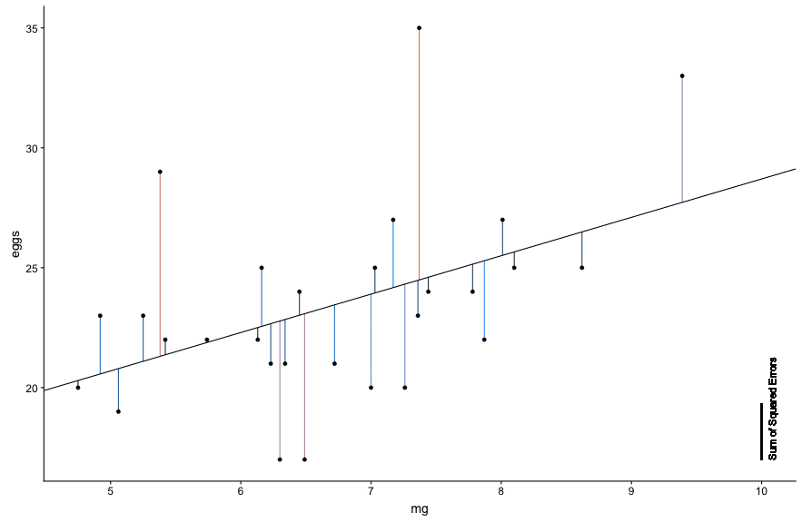

```{r setup, include=FALSE}
knitr::opts_chunk$set(echo = FALSE)
library(tidyverse) # for data wrangling etc...
library(cowplot)   # for nicer ggplot defaults
library(animation) # for animated gifs
```

## Overview

- Least squares regression intuition
- Assumptions
- Transformations

```{r, include=FALSE}
########################## Least Squares Regression Intuition ##########################
```

## Least Squares Intuition

```{r intuition data, echo=FALSE}
## This code is included here to show what I did.
## The frames created by this chunk were stitched together using Time Lapse Assembler and uploaded to YouTube

# data set
set.seed(23048)
dat <- data_frame(x = rnorm(20)) %>%
       mutate(x = x - mean(x),
              y = x + rnorm(length(x)))

# calculate regression line
regLine <- lm(y ~ x, data = dat) %>%
           coefficients()

##### take a look at the data #####
ggplot(dat, aes(x, y)) + 
    geom_point() +
    geom_abline(slope = regLine[2], intercept = regLine[1])
```

## Least Squares Intuition

```{r with error terms, echo=FALSE}
mutate(dat, 
       pred = regLine[2]*x + regLine[1],
       error = pred - y) %>%
    ggplot(aes(x, y)) + 
    
    geom_segment(aes(xend = x, yend = pred, color = error)) +
    scale_color_gradient2(low = 'orange', midpoint = 0, mid = 'black', high = 'orange') +
    
    geom_point() +
    
    geom_abline(slope = regLine[2], intercept = regLine[1])
```

## Least Squares Intuition

```{r intuition video, include=FALSE}
# Function to calculate predicted value and error terms
#' @param m the slope of the line
#' @param b the intercept of the line
#' @param dat the data frame containing points the line is supposed to fit
#' @return the modified data frame with two additional values added: pred (predictions based on ab) and err (the error terms)
plotLine <- function(m, b, dat)
{
    g <- ggplot(mutate(dat,
                       pred = m*x + b,
                       error = pred - y),
                aes(x, y)) +

         geom_segment(aes(xend = x, yend = pred, color = error)) +
         scale_color_gradient2(low = 'orange', midpoint = 0, mid = 'black', high = 'orange') +
    
         geom_point() +
    
         geom_abline(slope = m, intercept = b)
    
    print(g)
}

width <- knitr::opts_chunk$get("dpi") * knitr::opts_chunk$get("fig.width")
height <- knitr::opts_chunk$get("dpi") * knitr::opts_chunk$get("fig.height")

if(!file.exists('intuitionVideo.gif')) # this takes a few seconds to render - don't recreate unless we really want to
    saveGIF(sapply(c(seq(from = regLine[2], to = 0.2, length = 90), # perturb the line
                     seq(from = 0.2, to = regLine[2], length = 10)),
                   plotLine, b = regLine[1], dat = dat), 
            movie.name = "intuitionVideo.gif", interval = 0.1, autobrowse = FALSE,
            ani.width = width, ani.height = height)
```


