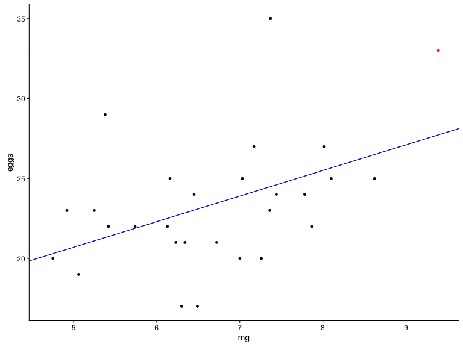

```{r setup, include=FALSE}
knitr::opts_chunk$set(echo = FALSE)
library(tidyverse) # for data wrangling etc...
library(cowplot)   # for nicer ggplot defaults
library(animation) # for animated gifs
library(car)       # for linear regression diagnostics
library(broom)     # for `augment()`
library(knitr)     # for `kable()`
library(kableExtra)# for additional kable formatting options
```

# Overview

- Least squares regression intuition
- Assumptions
    - What are they?
    - Causes of assumption violation
    - Consequences
    - Model diagnostics
- Transformations

```{r, include=FALSE}
########################## Least Squares Regression Intuition ##########################
```

# Least Squares Intuition

```{r intuition data, echo=FALSE}
p.platensis <- matrix(c(5.38,	29,
                        7.36,	23,
                        6.13,	22,
                        4.75,	20,
                        8.10,	25,
                        8.62,	25,
                        6.30,	17,
                        7.44,	24,
                        7.26,	20,
                        7.17,	27,
                        7.78,	24,
                        6.23,	21,
                        5.42,	22,
                        7.87,	22,
                        5.25,	23,
                        7.37,	35,
                        8.01,	27,
                        4.92,	23,
                        7.03,	25,
                        6.45,	24,
                        5.06,	19,
                        6.72,	21,
                        7.00,	20,
                        9.39,	33,
                        6.49,	17,
                        6.34,	21,
                        6.16,	25,
                        5.74,	22), 
                      byrow = TRUE, ncol = 2, dimnames = list(NULL, c('mg', 'eggs'))) %>%
               as_data_frame()

# simulated data set
set.seed(23048)
dat <- data_frame(x = rnorm(20)) %>%
       mutate(x = x - mean(x),
              y = x + rnorm(length(x)))

# calculate regression line
regLine <- lm(eggs ~ mg, data = p.platensis) %>%
           coefficients()

##### take a look at the data #####
ggplot(p.platensis, aes(mg, eggs)) + 
    geom_point() +
    geom_abline(slope = regLine[2], intercept = regLine[1])
```

Sand flea data from [McDonald, J.H. 1989. Selection component analysis of the Mpi locus in the amphipod Platorchestia platensis. Heredity 62: 243-249](https://www.nature.com/articles/hdy198934).

See the [Handbook of Biological Statistics](http://www.biostathandbook.com/linearregression.html) for additional examples.

# Least Squares Intuition

```{r with error terms, echo=FALSE}
g <- mutate(p.platensis, 
            pred = regLine[2]*mg + regLine[1],
           error = pred - eggs) %>%
     ggplot(aes(mg, eggs)) + 
    
     geom_segment(aes(xend = mg, yend = pred, color = error)) +
     scale_color_gradient2(low = 'orange', midpoint = 0, mid = 'black', high = 'orange') +
     theme(legend.position = 'none') +
    
     geom_point() +
    
     geom_abline(slope = regLine[2], intercept = regLine[1]) +
    
     geom_segment(aes(x = 10, xend = 10, y = 17, yend = 63/257*13 + 17), size = 1,
                  color = rgb(63/257, 63/257*.65, 0)) +
    
     geom_text(aes(label = "Sum of Squared Errors", x = 10, y = 17), angle = 90, vjust = 2, hjust = 0)

g
```

# Least Squares Intuition

```{r intuition video, include=FALSE}
# Function to calculate predicted value and error terms
#' @param m the slope of the line
#' @param b the intercept of the line
#' @param dat the data frame containing points the line is supposed to fit
#' @return the modified data frame with two additional values added: pred (predictions based on ab) and err (the error terms)
plotLine <- function(m, b, dat)
{
    tmp <- mutate(dat,
                  pred = m*mg + b,
                  error = pred - eggs)
    g <- ggplot(tmp, aes(mg, eggs)) +

         geom_segment(aes(xend = mg, yend = pred, color = sqrt(abs(error)))) +
         scale_color_gradient(low = 'black', 
                               high = rgb(max(sqrt(abs(tmp$error))) / 3.7, max(sqrt(abs(tmp$error))) / 3.7 * 0.65, 0)) +
         theme(legend.position = 'none') +
    
         geom_point() +
    
         geom_abline(slope = m, intercept = b) +
        
         geom_segment(aes(x = 10, xend = 10, y = 17, yend = (sum(tmp$error^2)-300)/350*13 + 17), size = 1,
                      color = (rgb(sqrt((sum(tmp$error^2)-300)/257), sqrt((sum(tmp$error^2)-300)/250*.65), 0))) +
    # going up to orange...                  255 or 1                         165 or 0.65                  0
    
         geom_text(aes(label = "Sum of Squared Errors", x = 10, y = 17), angle = 90, vjust = 2, hjust = 0)
    
    print(g)
    invisible(max(sqrt(abs(tmp$error))))
}

width <- knitr::opts_chunk$get("dpi") * knitr::opts_chunk$get("fig.width")
height <- knitr::opts_chunk$get("dpi") * knitr::opts_chunk$get("fig.height")

if(!file.exists('intuitionVideo.gif')) # this takes a few seconds to render - don't recreate unless we really want to
    saveGIF(map2(c(seq(from = regLine[2], to = 0.2, length = 90), # perturb the line
                   seq(from = 0.2, to = regLine[2], length = 10)),# snap back to regression line
                 c(seq(from = regLine[1], to = 20, length = 90),  # perturb
                   seq(from = 20, to = regLine[1], length = 10)), # snap back
                 ~ plotLine(.x, .y, dat = p.platensis)), 
            movie.name = "intuitionVideo.gif", interval = 0.1, autobrowse = FALSE,
            ani.width = width, ani.height = height)
```


# Model Notation

eggs = β~0~ + β~1~ mg + ε

```{r model notation}
g
```

# Model Output

eggs = β~0~ + β~1~ mg + ε

```{r model output}
pp0 <- lm(eggs ~ mg, data = p.platensis)

summary(pp0) %>%
    capture.output() %>%
    `[`(8:14) %>%
    cat(sep = '\n')
```

eggs = ```r round(regLine[1], 1)``` + ```r round(regLine[2], 1)```*mg + ε


```{r, include=FALSE}
############################# Assumptions ##############################

########## Assumption 1 - MVN residuals ##########
```

# Assumption 1: Error terms are normally distributed

Two ways to test this assumption:

* Shapiro-Wilks test (quantitative, but sensitive to outliers)
* QQ-plot (graphical test)

```{r shapiro-wilks}
with(augment(pp0), shapiro.test(.std.resid))
```

* Null hypothesis: the error terms are normally distributed.
* Alternate hypothesis: we are violating this assumption.
    * In this case, large p-values are good news.
    * Probably won't reject the null hypothesis, but we should exercise caution.

See my code and `?shapiro.test` for more details.

# Assumption 1: Error terms are normally distributed

```{r outlierTest}
outlierTest(pp0)
```

* Null hypothesis: the data point is not an outlier.
    * Again, large p-values are good news.
    * Result is borderline significant, so we will evaluate this a little closer.

See my code and `?outlierTest` from the `car` package for more details.

# Influence

```{r influence1}
# Function to calculate predicted value and error terms
#' @param x x position
#' @param y y position
#' @param dat the data frame containing the rest of the data set
plotLine <- function(x, y, dat)
{
    dat$mg[24] <- x
    dat$eggs[24] <- y
    
    mdl <- lm(eggs ~ mg, data = dat)
    
    g <- ggplot(dat[-24,], aes(mg, eggs)) +
         geom_point() +
         #geom_smooth(method = 'lm', se = FALSE) +
        
         ylim(c(17, 35)) +
         xlim(c(4.7, 9.4)) +
        
         geom_abline(slope = regLine[2], intercept = regLine[1], linetype = 'dashed') +
         geom_abline(slope = coef(mdl)[2], intercept = coef(mdl)[1], color = 'blue') +
        
         geom_point(data = data_frame(x = x, y = y), aes(x, y), color = 'red')
    
    print(g)
}

plotLine(9.39, 33, p.platensis)
```

# Influence

```{r influence, include = FALSE}
width <- knitr::opts_chunk$get("dpi") * knitr::opts_chunk$get("fig.width")
height <- knitr::opts_chunk$get("dpi") * knitr::opts_chunk$get("fig.height")

if(!file.exists('influenceVideo.gif')) # this takes a few seconds to render - don't recreate unless we really want to
    saveGIF(map2(c(rep(9.39, 6),                             # (x) up to top right corner
                   seq(from = 9.39, to = 4.75, length = 50), # (x) over to top left corner
                   rep(4.75, 50),                            # (x) down to bottom left corner
                   seq(from = 4.75, to = 9.39, length = 50), # (x) over to bottom right corner
                   rep(9.39, 44)),                           # (x) back to starting point
                 c(seq(from = 33, to = 35, length = 6),      # (y) up to top right corner
                   rep(35, 50),                              # (y) over to top left corner
                   seq(from = 35, to = 17, length = 50),     # (y) down to bottom left corner
                   rep(17, 50),                              # (y) over to bottom right corner
                   seq(from = 17, to = 33, length = 44)),    # (y) back to starting point
                 plotLine, dat = p.platensis), 
            movie.name = "influenceVideo.gif", interval = 0.1, autobrowse = FALSE,
            ani.width = width, ani.height = height)
```



# Influence

```{r influencePlot}
par(cex.lab = 1.5, cex.axis = 1.25)
capture.output(influencePlot(pp0), file = '/dev/null')
```

* Studentized Residuals (y-axis): The number of standard deviations away from the trend line for each data point.
* Hat-Values (x-axis): A measure of how much the coefficients change (i.e. slope and intercept) if you exclude each data point. Vertical reference lines are drawn at twice and three times the average hat value.
* Cook's Distance (radius of bubbles): A measure of how much the error terms would change when excluding each data point.

We see our borderline significant outlier (#16) has very little influence over the coefficients, but it does result in a change in the error terms.

    * The trend line is not changed much if we exclude this data point from the analysis.
    * It does shift the line slightly up, which results in a slightly larger estimate for all data points.
    
The 24th data point is also highlighted here. It has a larger residual (not an outlier) and is on the edge of the distribution. This gives it increased leverage and influence.

See my code and `?influencePlot` from the `car` package for more details.

# Assumption 1: Error terms are normally distributed

```{r qqPlot}
par(cex.lab = 1.5, cex.axis = 1.25)
qqPlot(pp0, ylab = 'Studentized Residuals')
```

* Studentized Residuals (y-axis): The number of standard deviations away from the trend line for each data point. Error terms are ordered from lest (bottom left corner) to greatest (top right corner).
* t Quantiles (x-axis): The theoretical size of the residuals if the error terms perfectly followed a normal distribution.
* Solid line: If the error terms were perfectly normally distributed, all of the data points would lie along this line.
* Dashed lines: This region shows where we can expect the observed error terms to fall, given sampling variability.

We see our borderline outlier in the top right corner is larger than we would expect it to be, but not quite outside of the confidence region within which we can expect our error terms to fall.

See my code and `?qqPlot` from the `car` package for more details.

```{r, include = FALSE}
########## Assumption 2 - Linearity ##########
```

# Assumption 2: Linear Relationship

size = β~0~ + β~1~ length + ε

size = β~0~ + β~1~ length + β~2~ length^2^ + ε

```{r ashton data}
# I used a ruler to guestimate these values from Figure 2 of Ashton 2007 referenced below - probably not terribly accurate, but sufficient for this example
ashton <- data_frame(size = c(3, 2, 7, 11, 12, 10, 8, 9, 10, 13, 9, 7, 6, 13, 8, 2), # clutch size determined by x-ray imaging
                     length = c(284, 290, 290, 298, 299, 302, 306, 309, 310, 311, 
                                317, 317, 320, 323, 334, 334)) %>%                   # female carapace length in mm
          mutate(length2 = length^2)

ggplot(ashton, aes(length, size)) + 
    geom_point() + 
    geom_smooth(method = 'lm', se = FALSE) +
    geom_smooth(method = 'lm', se = FALSE, formula = y ~ x + identity(x^2), color = 'green4') +
    ylab("Clutch Size") +
    xlab("Carapace Length (mm)")
```

Data from [Ashton, K.G., R.L. Burke, and J.N. Layne. 2007. Geographic variation in body and clutch size of gopher tortoises. Copeia 2007: 355-363](http://www.asihcopeiaonline.org/doi/abs/10.1643/0045-8511(2007)7%5B355:GVIBAC%5D2.0.CO%3B2?code=asih-site)

# Assumption 2: Linear Relationship

size = β~0~ + β~1~ length + ε

```{r linear candidates1}
ash0 <- lm(size ~ length, data = ashton)
    
summary(ash0) %>%
    capture.output() %>%
    `[`(8:12) %>%
    cat(sep = '\n')
```

size = β~0~ + β~1~ length + β~2~ length^2^ + ε

```{r linear candidates2}
ash1 <- lm(size ~ length + length2, data = ashton)

summary(ash1) %>%
    capture.output() %>%
    `[`(8:15) %>%
    cat(sep = '\n')
```

# Component Residual Plots

size = β~0~ + β~1~ length + ε

```{r crPlots1}
crPlots(ash0)
```

# Component Residual Plots

size = β~0~ + β~1~ length + β~2~ length^2^ + ε

```{r crPlots2}
crPlots(ash1)
```


```{r include=FALSE}
########## Assumption 3: No/Little Multicollinearity ##########

# data from Gavish 2008 - extracted from figure 1 using pencil and ruler technique
#                 DBP, SBP, Time (24 hour)
bpTime <- matrix(c(56,  94, 17  ,
                   57,  94, 21  ,
                   59, 100, 20.5,
                   59, 104, 17.5,
                   60, 101, 16  ,
                   58, 109, 22  ,
                   61, 110, 21.5,
                   62, 112, 18.5,
                   63, 106, 18  ,
                   66, 111, 15.5,
                   66, 104, 19  ,
                   69, 107, 19.5,
                   69, 119, 16.5,
                   71, 121, 22.5,
                   74, 117, 20  ,
                   74, 121, 23  ,
                   85, 115,  4.5,
                   95, 158, 25  ,
                   82, 161, 10.5,
                   88, 156,  9  ,
                   98, 142, 24.5,
                   88, 142, 25.5,
                   81, 139, 26  ,
                   77, 143, 26.5,
                   93, 141, 13.5,
                   74, 143,  1.5,
                   75, 131,  4  ,
                   75, 131,  5  ,
                   77, 132, 15  ,
                   78, 136,  1  ,
                   77, 138, 11  ,
                   85, 111,  6.5,
                   77, 122, 23.5,
                   79, 121, 24  ,
                   79, 122, 10  ,
                   75, 122,  2  ,
                   77, 124,  7  ,
                   79, 127,  2.5,
                   81, 122,  3  ,
                   82, 125,  6  ,
                   88, 146, 12  ,
                   86, 143,  0  ,
                   86, 141,  8.5,
                   86, 144, 14  ,
                   83, 144,  9.5,
                   85, 140, 12.5,
                   82, 139,  3.5,
                   83, 138,  5.5,
                   81, 135,  0.5,
                   83, 137,  7.5,
                   82, 136, 11.5,
                   86, 136, 14.5,
                   85, 132, 13,
                   83, 132,  8  ),
                 byrow = TRUE, ncol = 3, dimnames = list(NULL, c('dbp', 'sbp', 'time'))) %>%
         as_data_frame() %>%
         arrange(time)


```


# No/Little Multicollinearity

```{r mcol1a}
set.seed(239)
```

```{r mcol1b, echo = TRUE}
mcol <- data_frame(x1 = rnorm(100),
                   x2 = x1 + rnorm(100), # x1 and x2 are correlated
                   x3 = rnorm(100),
                   y = x1 + x2 + x3 + rnorm(100))

# three models
model1 <- lm(y ~ x1 + x2 + x3, data = mcol) # everything
model2 <- lm(y ~ x1 +      x3, data = mcol) # without x2
model3 <- lm(y ~      x2 + x3, data = mcol) # without x1
```

# No/Little Multicollinearity - Variance Inflation Factors

```{r vif, echo = TRUE}
# check for multicollinearity
vif(model1)
vif(model2)
vif(model3)
```

# No/Little Multicollinearity - Model comparison

```{r mcol table}
data_frame(model = cell_spec(1:3, align = 'center'),
           x1 = {c(round(coef(model1)[2], 2),
                   round(coef(model2)[2], 2),
                   "") %>%
                 cell_spec(align = 'left')},
           x2 = {c(round(coef(model1)[3], 2),
                   "",
                   round(coef(model3)[2], 2)) %>%
                 cell_spec(align = 'left')},
           x3 = {c(round(coef(model1)[4], 2),
                   round(coef(model2)[3], 2),
                   round(coef(model3)[3], 2)) %>%
                 cell_spec(align = 'left')},
           r2 = {c(round(summary(model1)$r.squared, 2),
                   round(summary(model2)$r.squared, 2),
                   round(summary(model3)$r.squared, 2)) %>%
                 cell_spec(align = 'left')}) %>%
    
    kable(escape = FALSE) %>%
    kable_styling()
```

Model coefficients for our three models. Notice how the coefficient for `x3` doesn't change much, but the coefficients for `x1`, `x2` and R^2^ change quite a bit.

# No Autocorrelation

```{r auto1}
set.seed(2347890)
dat <- data_frame(x1 = seq(1, 20, length = 200),
                  y1 = sin(x1) + 0.1*x1 + rnorm(200))

ggplot(dat, aes(x1, y1)) +
     geom_point()
```

# No Autocorrelation

```{r auto2}
ggplot(dat, aes(x1, y1)) +
     geom_point() +
     geom_smooth(span = .3, method = 'loess', se = FALSE)
```

Adding a loess smoother highlights this periodic pattern in the data.

# No Autocorrelation

```{r auto3, echo=TRUE}
lm(y1 ~ x1, data = dat) %>%
    durbinWatsonTest()
```

# Homoscedasticity

```{r homo1, fig.width=4}
set.seed(234897)
dat <- data_frame(x1 = rnorm(200) + 3,
                  y1 = .25*x1 + rnorm(200),
                  y2 = abs(rnorm(200)*x1))

homModel <- lm(y1 ~ x1, data = dat)
hetModel <- lm(y2 ~ x1, data = dat)

ggplot(dat, aes(x1, y1)) +
    geom_point() +
    geom_smooth(method = 'lm', se=FALSE)

ggplot(dat, aes(x1, y2)) +
    geom_point() +
    geom_smooth(method = 'lm', se=FALSE)
```

# Homoscedasticity

`y1 ~ x1`

```{r homo2}
spreadLevelPlot(homModel)
ncvTest(homModel) # y1 ~ x1
```

# Homoscedasticity

`y2 ~ x1`

```{r homo3}
spreadLevelPlot(hetModel)
ncvTest(hetModel) # y2 ~ x1
```


# Homoscedasticity

```{r homo4}
summary(homModel)
```

# Homoscedasticity

```{r homo5}
summary(hetModel)
```


```{r, include=FALSE}
############################# Transformations ##############################
```

# Transformations

Many of the problems we encounter in linear regression stem from model choice.

Two most common transormations:

* Power transformations
* Log/exponential transformations

# Power Transformations

Original model: y ~ β~0~ + β~1~x + ε

With power transformation: y ~ β~0~ + β~1~x^2^ + ε

```{r x2, include = FALSE}
n <- 100

set.seed(923843)
pow2 <- data_frame(x = runif(n)*4,
                   x2 = x^2,
                   y = x2 + rnorm(n),
                   x_int = map2(x, x2, ~ seq(from = .x, to = .y, len = 60)))

plotLine <- function(i, dat)
{
    g <- mutate(dat, x_to_x2 = sapply(x_int, `[`, i)) %>%
         ggplot(aes(x_to_x2, y)) +
         geom_point() +
         geom_smooth(method = 'loess', se = FALSE)

    print(g)
}

if(!file.exists("pow2Video.gif"))
    saveGIF(map(c(1:60, 60:1), plotLine, dat = pow2), 
            movie.name = "pow2Video.gif", interval = 0.1, autobrowse = FALSE,
            ani.width = width, ani.height = height)
```


# Power Transformations

Original model: y ~ β~0~ + β~1~x + ε

With power transformation: y ~ β~0~ + β~1~sqrt(x) + ε

```{r x.5, include = FALSE}
n <- 100

set.seed(923843)
pow.5 <- data_frame(x = runif(n)*100,
                   x.5 = sqrt(x),
                   y = x.5 + rnorm(n, sd = 0.5),
                   x_int = map2(x, x.5, ~ seq(from = .x, to = .y, len = 60)))

plotLine <- function(i, dat)
{
    g <- mutate(dat, x_to_sqrt_x = sapply(x_int, `[`, i)) %>%
         ggplot(aes(x_to_sqrt_x, y)) +
         geom_point() +
         geom_smooth(method = 'loess', se = FALSE)

    print(g)
}

if(!file.exists("pow05Video.gif"))
    saveGIF(map(c(1:60, rep(60, 8), 60:1), plotLine, dat = pow.5), 
            movie.name = "pow05Video.gif", interval = 0.1, autobrowse = FALSE,
            ani.width = width, ani.height = height)
```


# Log Transformations

Original model: y ~ β~0~ + β~1~x + ε

With log transformation: y ~ β~0~ + β~1~ln(x) + ε

```{r lnx, include = FALSE}
n <- 100

set.seed(923843)
expx <- data_frame(x = runif(n)*10,
                   expx = exp(x),
                   y = x + rnorm(n, 5),
                   x_int = map2(expx, x, ~ exp(seq(from = log(.x), to = log(.y), len = 60))))

plotLine <- function(i, dat)
{
    g <- mutate(dat, x_to_lnx = sapply(x_int, `[`, i)) %>%
         ggplot(aes(x_to_lnx, y)) +
         geom_point() +
         geom_smooth(method = 'loess', se = FALSE)

    print(g)
}

if(!file.exists("lnxVideo.gif"))
    saveGIF(map(c(1:60, rep(60, 8), 60:1), plotLine, dat = expx), 
            movie.name = "lnxVideo.gif", interval = 0.1, autobrowse = FALSE,
            ani.width = width, ani.height = height)
```


# Log Transformations

Original model: y ~ β~0~ + β~1~x + ε

With log transformation: ln(y) ~ β~0~ + β~1~x + ε

```{r lny, include = FALSE}
n <- 100

set.seed(923843)
lny <- data_frame(x = runif(n)*10,
                  expx = exp(x),
                  y = exp(x + rnorm(n, 5)),
                  y_int = map2(y, log(y), ~ exp(seq(from = log(.x), to = log(.y), len = 60))))

plotLine <- function(i, dat)
{
    g <- mutate(dat, y_to_lny = sapply(y_int, `[`, i)) %>%
         ggplot(aes(x, y_to_lny)) +
         geom_point() +
         geom_smooth(method = 'loess', se = FALSE)

    print(g)
}

if(!file.exists("lnyVideo.gif"))
    saveGIF(map(c(1:60, rep(60, 8), 60:1), plotLine, dat = lny), 
            movie.name = "lnyVideo.gif", interval = 0.1, autobrowse = FALSE,
            ani.width = width, ani.height = height)
```


```{r, include=FALSE}
############################# Closing ##############################
```

# Assumptions Summary

```{r assumptions}
# this is the table I want, but I also want some better formatting
# | Assumption                  | Cause                | Consequence                 | Diagnosis                 |
# |:----------------------------|:---------------------|:----------------------------|:--------------------------|
# | Linear Relationship         | Bad model            | Inaccurate predictions      | `car::crPlots()`          |
# | Multivariate Normality      | Bad model            | Incorrect statistics        | `car::qqPlot()`           |
# |                             | Noisy data           | (p-values / CIs)            | `shapiro.test(residuals)` |
# | No/Little Multicollinearity | Correlated variables | Unstable model coefficients | `car::vif()`              |
# | No Autocorrelation          | Non-independent data | Inefficient estimators      | `car::durbinWatsonTest()` |
# | Homoscedasticity            | Bad model            | Incorrect statistics        | `car::ncvTest()`          |
# |                             | "Bad" data           | (p-values / CIs)            | `car::spreadLevelPlot()`  |

tab <- data_frame(Assumption = c('Linear Relationship', 'Multivariate Normality', 'Multivariate Normality', 
                                 'No/Little Multicollinearity', 'No Autocorrelation', 'Homoscedasticity', 'Homoscedasticity'),
                  Cause = c('Incorrect model', 'Incorrect model', 'Noisy data', 'Correlated variables', 
                            'Non-independent data', 'Incorrect model', '"Bad" data'),
                  Consequence = c('Inaccurate predictions', 'Incorrect statistics', '(p-values / CIs)', 
                                  'Unstable model coefficients', 'Inefficient estimators', 'Incorrect statistics',
                                  '(p-values / CIs)'),
                  Diagnosis = c('car::crPlots()', 'car::qqPlot()', 'shapiro.test(residuals)', 'car::vif()', 
                                'car::durbinWatsonTest()', 'car::ncvTest()', 'car::spreadLevelPlot()'))

kable(tab) %>%
    column_spec(column = 4, monospace = TRUE) %>%
    collapse_rows(columns = 1, valign = 'top') %>%
    kable_styling()
```

# Thanks

Statistics for Lunch Team
    * Greg Alvord
    * Eckart Bindewald
    * Taina Immonen
    * Brian Luke
    * George Nelson
    * Ravi Ravichandran
    * Tom Schneider
